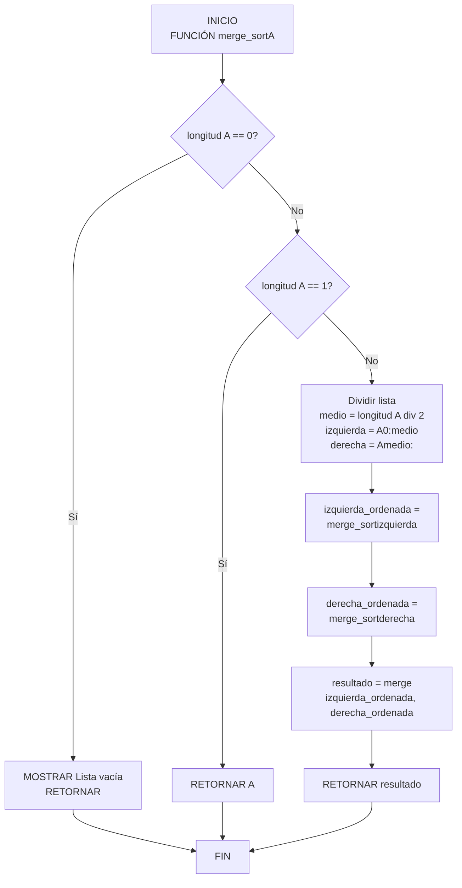
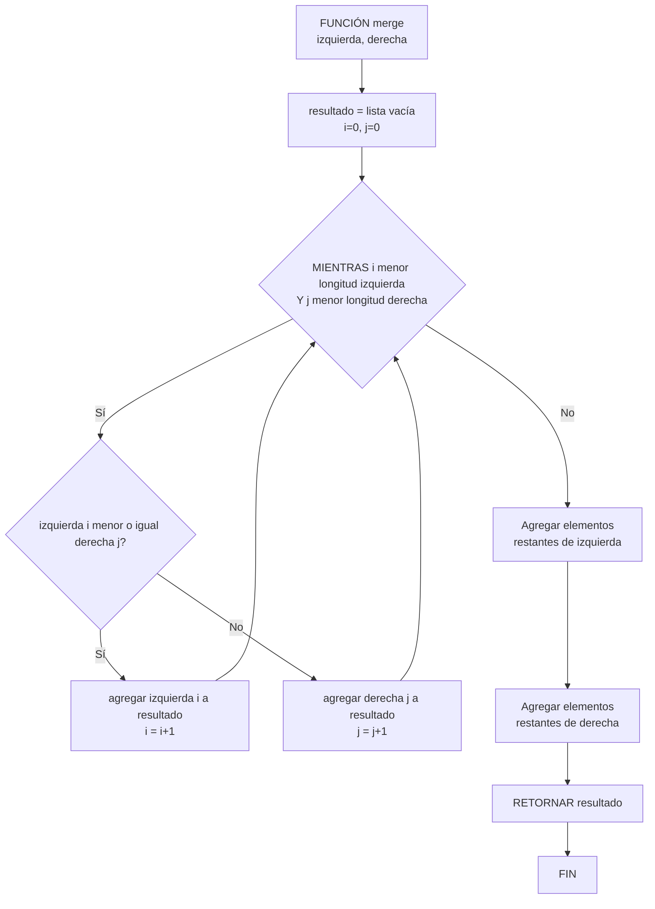
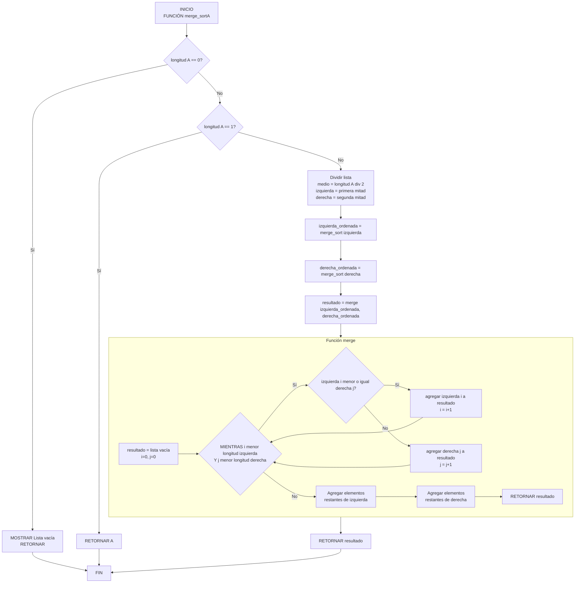

# Diagrama de Flujo - Algoritmo Merge Sort

## Diagrama Principal - Función merge_sort()

```mermaid
flowchart TD
    A[INICIO<br>FUNCIÓN merge_sortA] --> B{longitud A == 0?}
    B -- Sí --> C[MOSTRAR Lista vacía<br>RETORNAR]
    B -- No --> D{longitud A == 1?}
    D -- Sí --> E[RETORNAR A]
    D -- No --> F[Dividir lista<br>medio = longitud A div 2<br>izquierda = A0:medio<br>derecha = Amedio:]
    F --> G[izquierda_ordenada =<br>merge_sortizquierda]
    G --> H[derecha_ordenada =<br>merge_sortderecha]
    H --> I[resultado = merge<br>izquierda_ordenada, derecha_ordenada]
    I --> J[RETORNAR resultado]
    C --> K[FIN]
    E --> K
    J --> K
```

## Diagrama de la Función merge()

```mermaid
flowchart TD
    A[FUNCIÓN merge<br>izquierda, derecha] --> B[resultado = lista vacía<br>i=0, j=0]
    B --> C{MIENTRAS i menor longitud izquierda<br>Y j menor longitud derecha}
    C -- Sí --> D{izquierda i menor o igual derecha j?}
    D -- Sí --> E[agregar izquierda i a resultado<br>i = i+1]
    D -- No --> F[agregar derecha j a resultado<br>j = j+1]
    E --> C
    F --> C
    C -- No --> G[Agregar elementos<br>restantes de izquierda]
    G --> H[Agregar elementos<br>restantes de derecha]
    H --> I[RETORNAR resultado]
    I --> J[FIN]
```

## Diagrama Completo Integrado

```mermaid
flowchart TD
    Start[INICIO<br>FUNCIÓN merge_sortA] --> CheckEmpty{longitud A == 0?}
    
    CheckEmpty -- Sí --> ShowEmpty[MOSTRAR Lista vacía<br>RETORNAR]
    
    CheckEmpty -- No --> CheckSingle{longitud A == 1?}
    CheckSingle -- Sí --> ReturnSingle[RETORNAR A]
    
    CheckSingle -- No --> Divide[Dividir lista<br>medio = longitud A div 2<br>izquierda = primera mitad<br>derecha = segunda mitad]
    Divide --> RecursiveLeft[izquierda_ordenada = merge_sort izquierda]
    RecursiveLeft --> RecursiveRight[derecha_ordenada = merge_sort derecha]
    RecursiveRight --> MergeCall[resultado = merge izquierda_ordenada, derecha_ordenada]
    
    MergeCall --> MergeProcess
    
    subgraph MergeProcess [Función merge]
        M1[resultado = lista vacía<br>i=0, j=0] --> M2{MIENTRAS i menor longitud izquierda<br>Y j menor longitud derecha}
        M2 -- Sí --> M3{izquierda i menor o igual derecha j?}
        M3 -- Sí --> M4[agregar izquierda i a resultado<br>i = i+1]
        M3 -- No --> M5[agregar derecha j a resultado<br>j = j+1]
        M4 --> M2
        M5 --> M2
        M2 -- No --> M6[Agregar elementos<br>restantes de izquierda]
        M6 --> M7[Agregar elementos<br>restantes de derecha]
        M7 --> M8[RETORNAR resultado]
    end
    
    MergeProcess --> ReturnResult[RETORNAR resultado]
    ShowEmpty --> End[FIN]
    ReturnSingle --> End
    ReturnResult --> End
```

